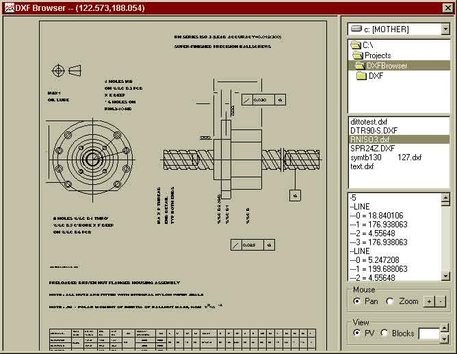



## View DXF FIles

### Description

This program will open and allow you to view any '2D' ASCII DXF file. It supports BLOCKS, INSERTS, DIMENSIONS, and ALL 2D GEOMETRY types (for R12 and R13). It stores the DXF data in an array, so you have full access to perform manipulation and calculations on the geometry. NO OCX REQUIRED - just pure VB. *Keep an eye out for an update that will hande R14 and DWG 2D files.
 
### More Info
 

             |
---                |---
**Submitted On**   |2001-01-25 08:32:28
**By**             |[Dave Andrews](https://github.com/Planet-Source-Code/PSCIndex/blob/master/ByAuthor/dave-andrews.md)
**Level**          |Advanced
**User Rating**    |4.8 (110 globes from 23 users)
**Compatibility**  |VB 5\.0, VB 6\.0
**Category**       |[Data Structures](https://github.com/Planet-Source-Code/PSCIndex/blob/master/ByCategory/data-structures__1-33.md)
**World**          |[Visual Basic](https://github.com/Planet-Source-Code/PSCIndex/blob/master/ByWorld/visual-basic.md)
**Archive File**   |[CODE\_UPLOAD141551252001\.zip](https://github.com/Planet-Source-Code/dave-andrews-view-dxf-files__1-14710/archive/master.zip)

